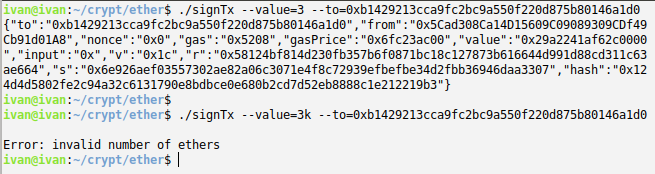

# ДЗ №5

## Задание

Разработать консольное приложение, принимающее в качестве параметров количество ETH, которое необходимо отправить, и адрес назначения. Секретный ключ от Ethereum адреса "зашит" в программу. На выходе в консоль печатается результат - подписанная транзакция в формате JSON, которую можно отправить в сети Ethereum.


## Запуск

Вариант 1

```
go run signTx.go [параметры]
```

Вариант 2 (с предварительной сборкой)

```
go build signTx.go
./signTx [параметры]
```


## Пример работы программы

  
  
-----------------------------------------------------------  
