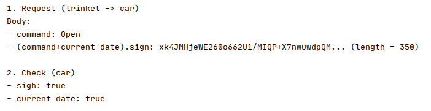
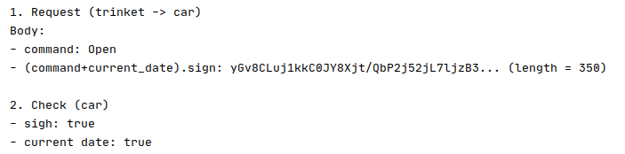
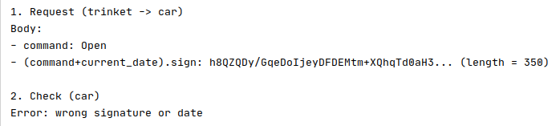

# ДЗ №4

## Задание

Разработать консольное приложение (UNS (User Name Service)), реализующее name-сервис для создания профилей пользователей в IPFS. Это сервис, в котором “именем” является комбинация “user_name + user_public_key”, а ответом на запрос по имени является IPFS-линк на данные о пользователе. При этом, user, владеющий секретным ключом от public key, может обновить IPFS ссылку на свой профиль, отправив в сервис запрос на обновление, подписав новую ссылку своим секретным ключом. 

User story:

    - пользователь: генерирует пару ключей ECDSA (любая кривая) - public и secret 
    - пользователь: загружает в IPFS (на одну из нод) данные о себе - кучу текста и получает IPFS линк
    - пользователь: отправляет в наш сервис три параметра: имя (“vasya:public_key"), ipfs линк, и подпись нового линка
    - сервис: смотрит, есть ли у него запись для “user:public_key” и добавляет (или обновляет) ее на последнюю версию, если подпись верна
    - пользователь рассказывает всему миру, что в нашем сервисе есть ссылка на данные о нем (публикует на сайте строку “user:public-key”)
    - теперь любой обратившийся к сервису, запросив “user:public-key” должен получить ipfs линк последней версии (в идеале и контент тоже)


Для программирования ДЗ упростить схему следующим образом:

    - программа сохраняет запись как строку в файл и просто заменяет эту одну строку, если пользователь прислал обновление с правильной подписью.
    - “отправляемые” данные - просто параметры командной строки, чтобы обойтись без сетевых запросов
    - формат имен (identity пользователя) представлен в формате “<username>:<pubkey>”, например “vasya:ffddee11223...99”, pubkey и signature - в hex формате


Программа позволяет сделать set (обновить name-record для пользователя) и get (запросить данные по пользователю). Программа должна всегда выводить самую последнюю версию линка (продемонстрировать, что после обновления сервис отвечает обновленными данными).
+ Также программа позволяет сделать generate-keys (сгенерировать новую пару ключей) и sign (сгенерировать подпись для указанной строки)

+ Программа позволяет работать с несколькими пользователями и выполняет отображение данных о пользователе из IPFS при запросе


## Запуск

Вариант 1

```
go run uns-server.go [параметры]

```

Вариант 2 (с предварительной сборкой)

```
go build uns-server.go
./uns-server [параметры]

```


## Пример выполнения программы

Результаты успешной аутентифика́ции в разные моменты времени:
  
1)  
  
-----------------------------------------------------------   
  
2)  
  
  

  
-----------------------------------------------------------  
 
  
Результат в случае неудачи:  
  

