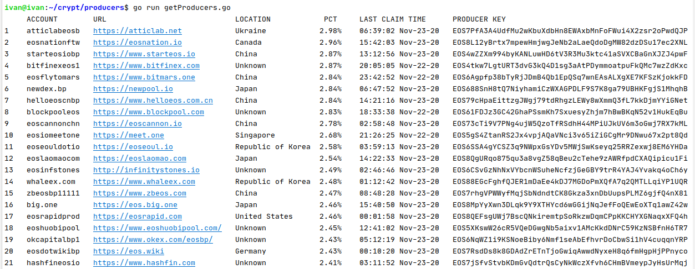

# ДЗ №6

## Задание

Разработать консольное приложение, получающее и выводящее данные о валидаторах одной из публичных сетей. Для этого нужно самостоятельно изучить документацию по консенсусу и govenance-механизмам и написать код, обращающийся к одной из публичных нод, который выводит список адресов валидаторов(минимально необходимо для выполнения ДЗ) и важную по вашему мнению информацию о них (степень важности определяете сами: это могут быть голосующие стейки, время следующих перевыборов, доля в общем стейке и т.п.)
 
Для получения данных использовать одну из следующих работающих публичных сетей:

Ethereum-based: PoA Network, xDAI, VELAS   
**EOS-based**: **EOS**, Cyberway, DAOBet  
TON-based: FreeTON  
Parity Substrate-based: Polkadot, Kusama, Robonomica  
Any PoS-based public blockchain: NEAR, Solana, etc...  


## Запуск

Вариант 1

```
go run getProducers.go
```

Вариант 2 (с предварительной сборкой)

```
go build getProducers.go
./getProducers
```


## Пример работы программы

  
Получение данных о 21 блок-продюсере сети EOS
  
  
  

  
-----------------------------------------------------------  
