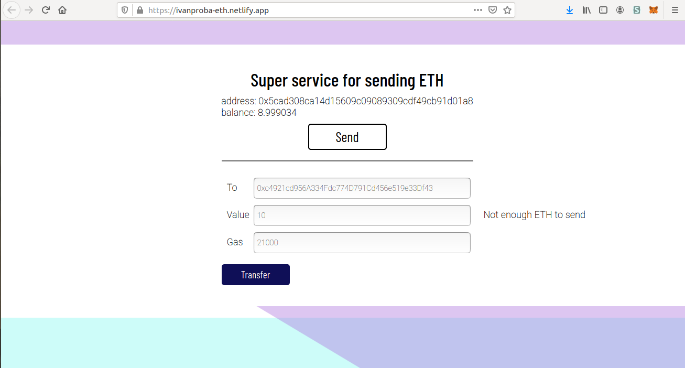
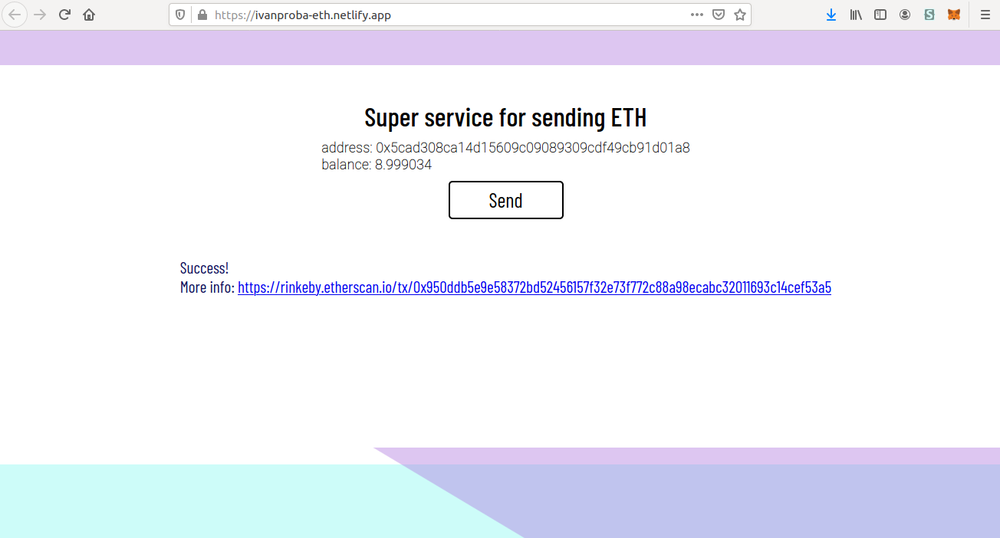

# ДЗ №8

## Задание

Запустить один из смарт-контрактов smartz.io в ТЕСТОВУЮ сеть Ethereum и создать web-странцу (репозитарий в github), на которой вызывается одна или несколько функций выложенного контракта.
Предоставить адрес задеплоенного контракта и либо поднятый сайт, либо screencast с вызовом функции. Если для теста необходимо что-то отправить преподавателю, можно использовать адрес 0x6290C445A720E8E77dd8527694030028D1762073.

(Но мы будем просто узнавать баланс и отправлять транзакцию с помощью MetaMask)

  
## Установка и запуск

Установка зависимостей

```
npm install
```

Запуск dev сервера

```
npm start
```

  

## Ссылка на страницу

[https://ivanproba-eth.netlify.app/](https://ivanproba-eth.netlify.app/)


## Скриншоты
  
  
  
    
    
-----------------------------------------------------------  
