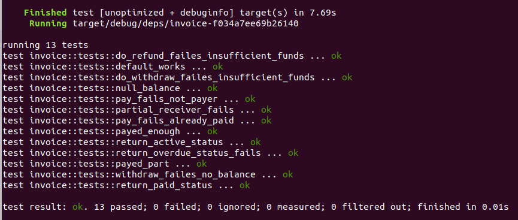

# ДЗ №10

## Задание

Написание контракта для Parity Substrate на Rust и тестов к нему.
Контракт: выставление счёта (как в дз7 (https://github.com/UlianaBespalova/Cryptography_and_decentralized_systems/blob/dz7_smartContracts/Invoice/Invoice_updated.sol), только на Rust).


  
## Запуск тестов

Предварительный запуск тестовой ноды:
```
./target/release/node-template --dev --tmp
```

Тестирование:
```
cargo +nightly test
```


## Пример

  
  
  


  
-----------------------------------------------------------  
