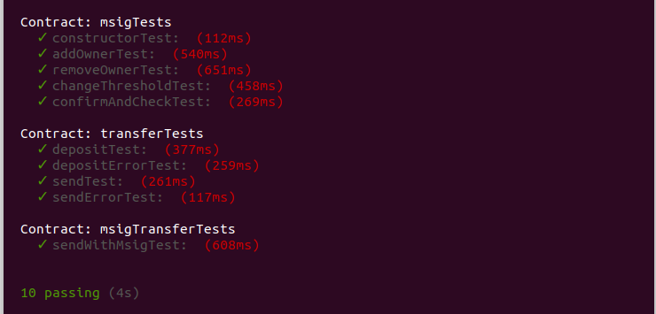

# ДЗ №9

## Задание

Написание контракта на Solidity и тестов к нему
  
1) ERC-20  
- Интерфейс стандарта ERC20
- Каждый имеет возможность совершать операции mint/burn
- Нельзя выполнять mint и burn в рамках одной транзакции
  
2) Msig
- Контракт для хранения эфира
- Операции перевода (внести/послать эфир)
- Операции работы с мультиподписью (добавить/удалить участника, изменить порог)


## Установка

```
npm install
truffle build
```
  
## Запуск тестов

Предварительный запуск тестовой ноды:
```
ganache-cli
```

Тестирование:
```
truffle test
```


## Пример

  
ERC-20
  
  
  
  
 
Multysig
  
  

  
-----------------------------------------------------------  
